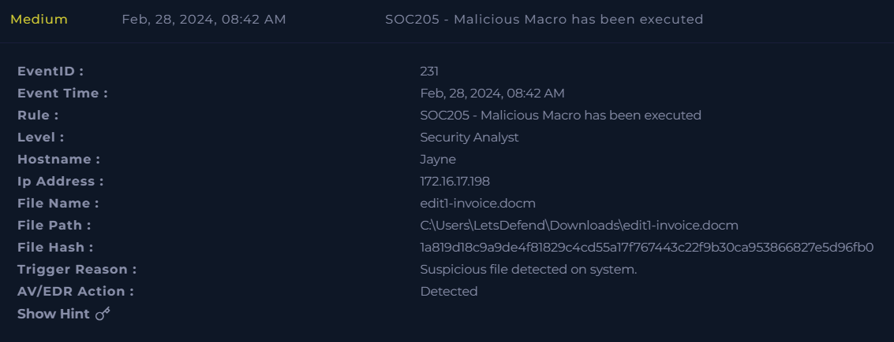
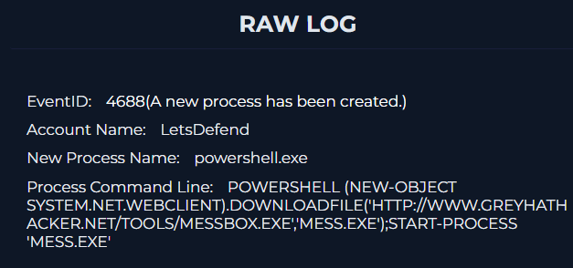
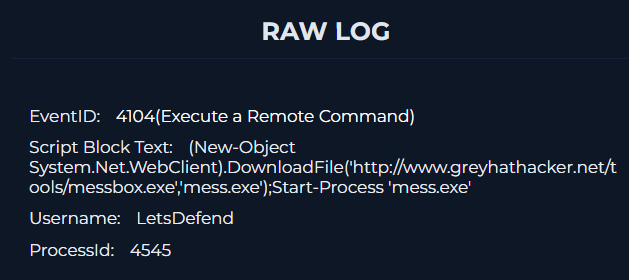
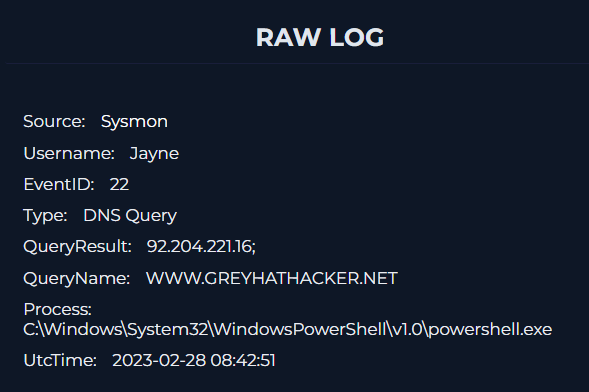

# Phishing Macro → PowerShell Investigation

## Overview

This repository documents an investigation into a phishing-delivered macro-enabled document that led to PowerShell execution and an attempted payload download.

The case began with a phishing email sent to the user **Jayne**. The email contained a password-protected ZIP archive named `edit1-invoice.docm.zip`. After the archive was accessed and the embedded document was opened, `WINWORD.EXE` executed a macro that triggered PowerShell.

The PowerShell command attempted to download a secondary payload from an external domain and then execute it. However, available evidence shows that the HTTP request returned **404**, and no confirmed execution of the secondary payload was observed.

## Investigation Scope

This project focuses only on what is supported by the available logs and screenshots.

Confirmed:
- Phishing email delivery
- ZIP archive creation in the Downloads folder
- Execution of `WINWORD.EXE`
- Creation of `powershell.exe`
- PowerShell script block execution
- DNS query to `www.greyhathacker.net`
- HTTP GET request for `messbox.exe`
- Host containment action

Not confirmed:
- Successful download of the secondary payload
- Execution of `mess.exe`
- Persistence
- Data exfiltration
- Full host compromise

## Key Evidence

### 1. Alert Overview
The investigation began with an alert indicating that a malicious macro-enabled document was executed.

### 2. WINWORD Execution
A process creation event shows `WINWORD.EXE` opening the malicious document.

### 3. PowerShell Launch
A process creation event shows `powershell.exe` executing a command to download `messbox.exe` and start `mess.exe`.

### 4. Script Block Logging
PowerShell script block logging confirms the same command behavior.

### 5. Network Attempt
A DNS query and HTTP request to `www.greyhathacker.net` were observed. The payload request returned **404**.

## Findings

The evidence supports a phishing-to-macro-to-PowerShell execution chain. The document was malicious, and PowerShell attempted to retrieve a secondary payload from an external domain. However, the request returned **404**, and no evidence was found showing that the secondary payload was successfully downloaded or executed.

This distinction is important: malicious execution of the document and PowerShell activity are confirmed, but full compromise is **not** confirmed from the available evidence.

## Repository Contents

- `IOC.md` - extracted indicators of compromise
- `MITRE.md` - ATT&CK mapping based on confirmed behavior
- `TIMELINE.md` - event-by-event chronology
- `diagram.md` - simplified attack flow

## Skills Demonstrated

- Phishing investigation
- Endpoint and process analysis
- PowerShell log review
- IOC extraction
- Evidence-based scoping
- MITRE ATT&CK mapping
- Timeline construction

## Tags

`phishing` `macro` `powershell` `incident-response` `threat-detection` `soc-analysis` `mitre-attack` `malware-investigation`
